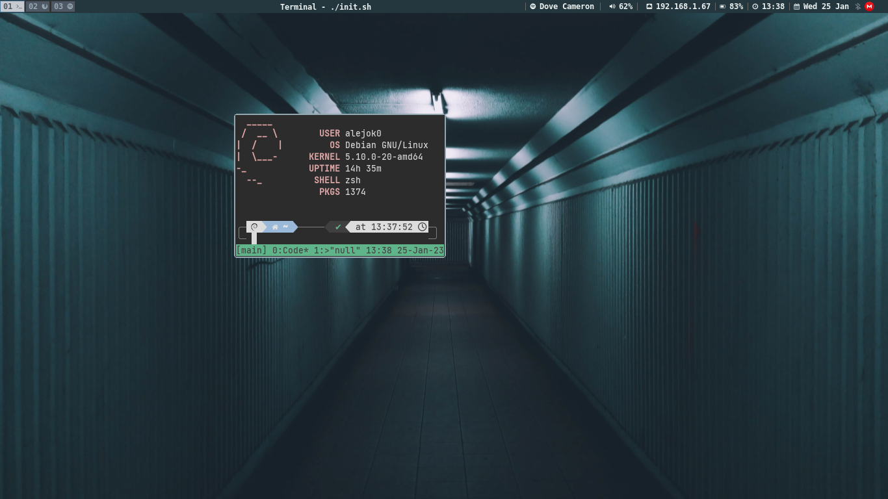

# config-i3
Configuracion de i3-gaps e i3-blocks

Requisitos:

sudo add-apt-repository -y ppa:regolith-linux/stable
sudo apt install i3-gaps

i3blocks
i3gaps
compton
feh
scroot
dmenu
terminator
pcmanfm

awesome-font

#Vista previa

